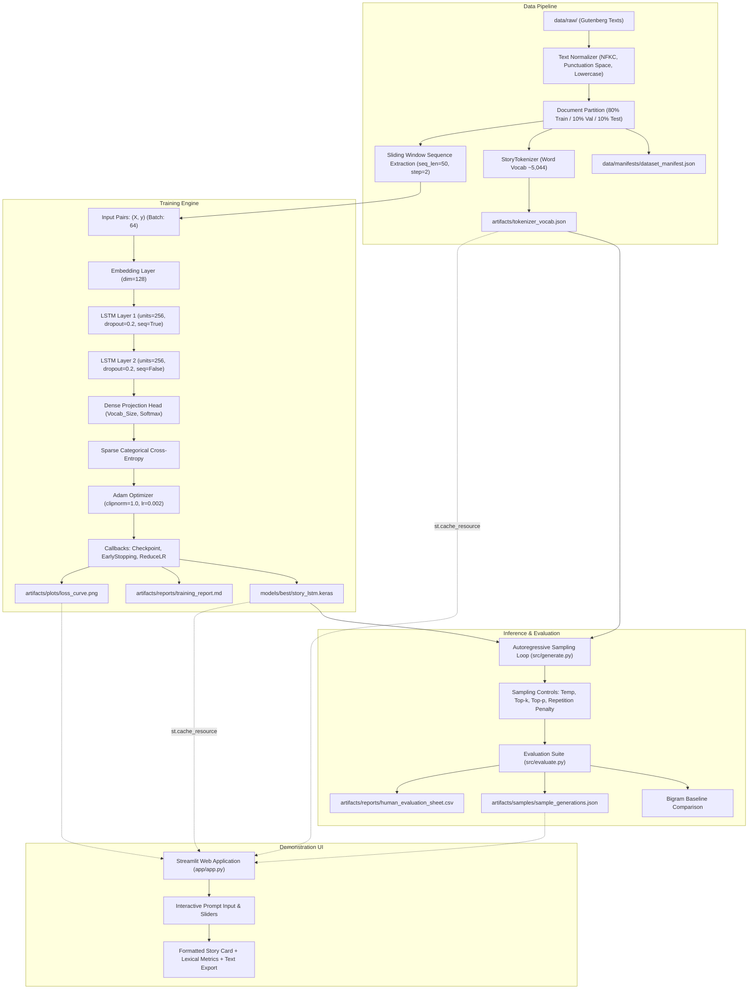
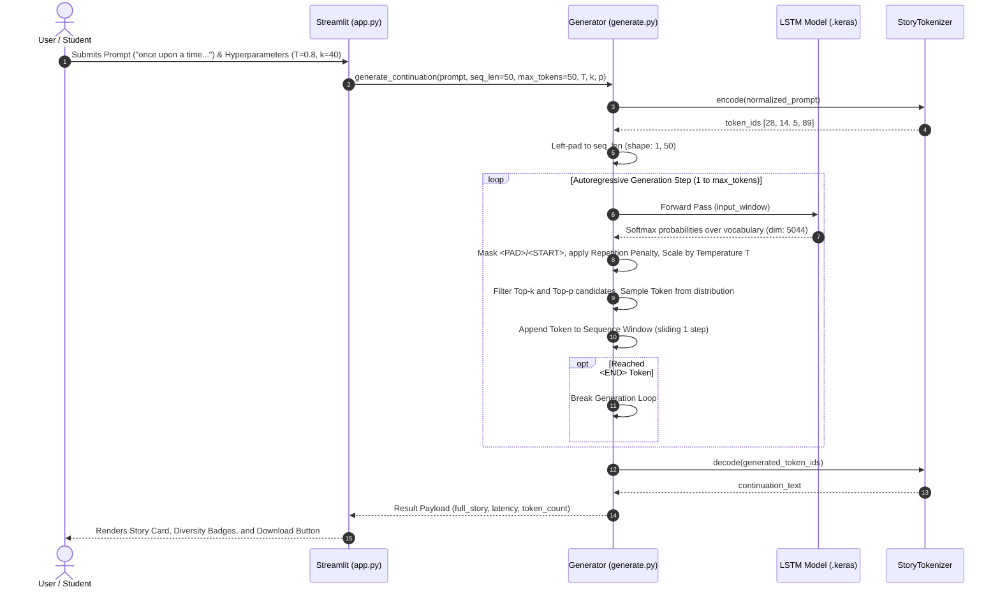

# System Architecture Specification: Story Continuation Generator

**Project:** MDM Foundation of Generative AI - Story Continuation Generator (LSTM)  
**Hardware Node:** ASUS Zenbook 14 OLED (Intel Core Ultra 5 125H, 14 Cores / 18 Threads, 16 GB LPDDR5X RAM)  
**Execution Strategy:** Local CPU-First Execution with oneDNN Vector Acceleration

---

## 1. End-to-End Architectural Topology

The system comprises four decoupled, auditable layers: Data Engineering, Recurrent Modeling & Training, Autoregressive Inference, and User Demonstration.

---

## 2. Component Boundaries & Interfaces

| Component | Input | Output | Invariants & Failure Guards |
| :--- | :--- | :--- | :--- |
| **`src/preprocessing.py`** | Raw Gutenberg `.txt` files | Normalized stories & document splits | Strips legal preambles/postambles; enforces NFKC Unicode; document-level partition prevents data leakage. |
| **`src/tokenizer.py`** | Document token sequences | Word-to-index map & token IDs | Fixed indices for `<PAD>` (0), `<UNK>` (1), `<START>` (2), `<END>` (3); persists to deterministic JSON artifact. |
| **`src/sequences.py`** | Token ID streams | Windowed $(X, y)$ ndarrays | Input shape $(N, 50)$; sparse integer target $(N,)$; left-padding for short sequences; zero-copy batching. |
| **`src/model.py`** | Sequence tensor $(B, 50)$ | Logits / Softmax $(B, V)$ | 2 stacked LSTM layers with recurrent dropout; gradient clipping (`clipnorm=1.0`) prevents gradient explosion. |
| **`src/train.py`** | Config YAML & dataset | `.keras` checkpoints & metrics | Checkpointing saves only optimal validation loss model; early stopping terminates plateauing runs. |
| **`src/generate.py`** | User prompt string + params | Continuation string + stats | Left-pads short prompts; masks `<PAD>`/`<START>` tokens; applies temperature, top-$k$, top-$p$, and repetition penalty. |
| **`src/evaluate.py`** | Trained model & test set | Objective metrics & sweep table | Calculates test loss, Perplexity ($\exp(\mathcal{L})$), Distinct-1/2, repetition ratio, and bigram baseline comparison. |
| **`app/app.py`** | UI controls & user inputs | Interactive Streamlit demo | Uses `st.cache_resource` to avoid model reload across interactions; provides safe export without external dependencies. |

---

## 3. Data Flow Diagram

---

## 4. Artifact Dependency Hierarchy

1. `configs/config.yaml` $\to$ Controls all parameters and file paths.
2. `scripts/prepare_data.py` $\to$ Generates `data/processed/*.txt`, `data/manifests/dataset_manifest.json`, and `artifacts/tokenizer_vocab.json`.
3. `src/train.py` $\to$ Consumes processed data and tokenizer; writes `models/best/story_lstm.keras`, `artifacts/plots/loss_curve.png`, `artifacts/metrics/metrics.json`, and `artifacts/reports/training_report.md`.
4. `src/evaluate.py` $\to$ Consumes test split and best model; writes `artifacts/samples/sample_generations.json`, `artifacts/reports/human_evaluation_sheet.csv`, and baseline benchmarks.
5. `app/app.py` $\to$ Loads trained model, tokenizer, and metrics artifacts to serve the demonstration UI.
